      Android课程大作业
			猫咪随记

首先我们打开手机，可以看到我们下载好的APP猫咪随机，封面是一只猫爪，我们打开它！
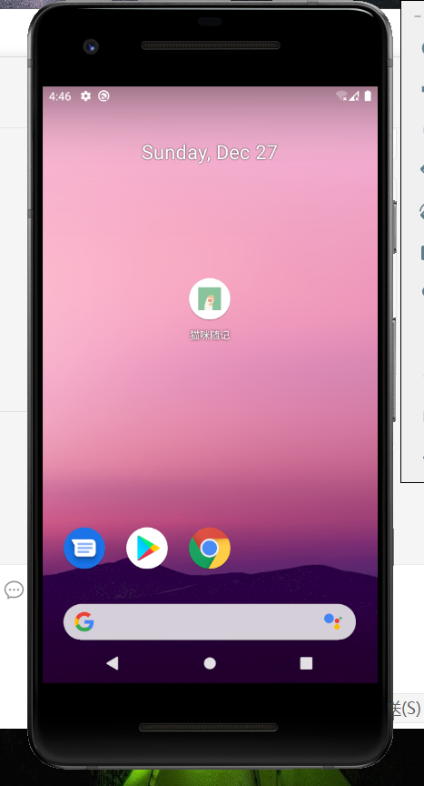

进入猫咪随记会有一个welcome的界面，这是每次打开APP都需要进行的，当然也可以跳过，这个界面只会持续两秒。
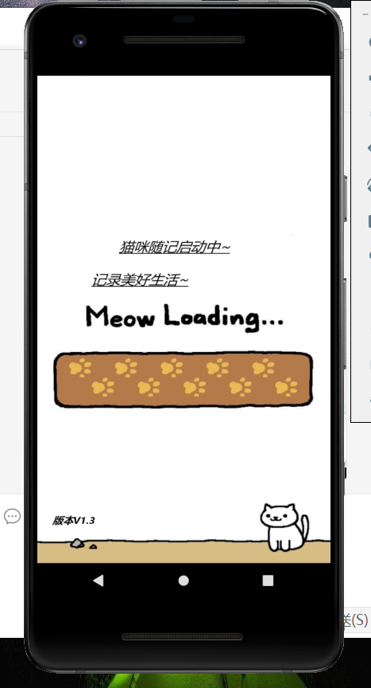

成功跳过欢迎界面进入APP后我们会进入到登录界面，只有输入注册过的账户的账户密码才能成功登录，所以我们进入注册界面~
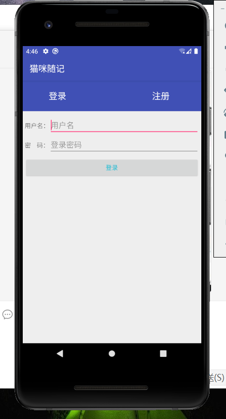

点击注册按钮进入注册界面

注册界面
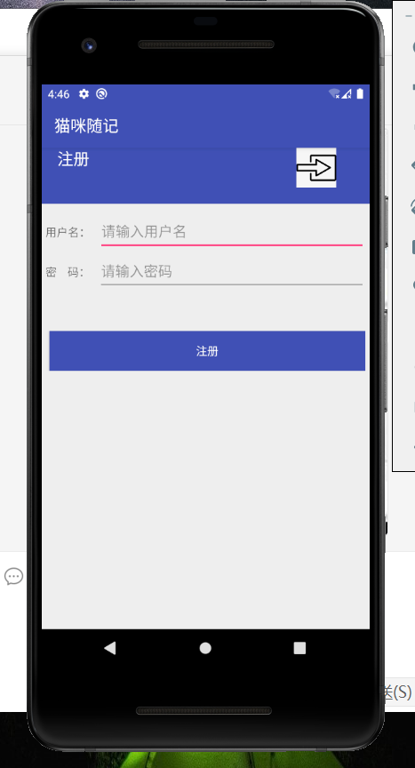

点击图片回到登录界面
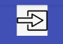

回到登录界面，输入注册过的账户密码进行登录，进入程序主界面
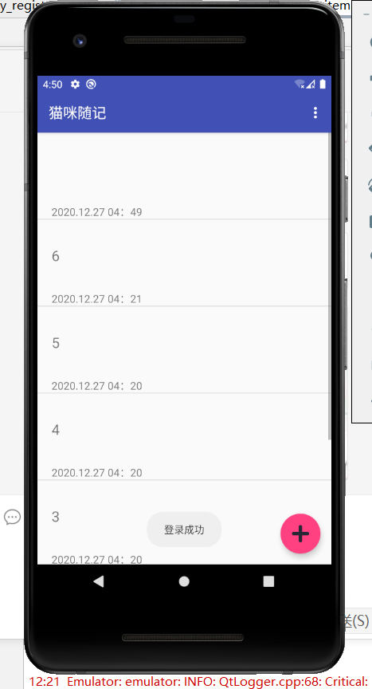

接下来可以看见有许多的随记，在写随记的同时我给他添加了时间戳的显示，你每次写随记时候都能看到随记写的时间，并且也能看到更改的时间。
向下拖动可以看到更多的随记，这里的text我使用了listview。
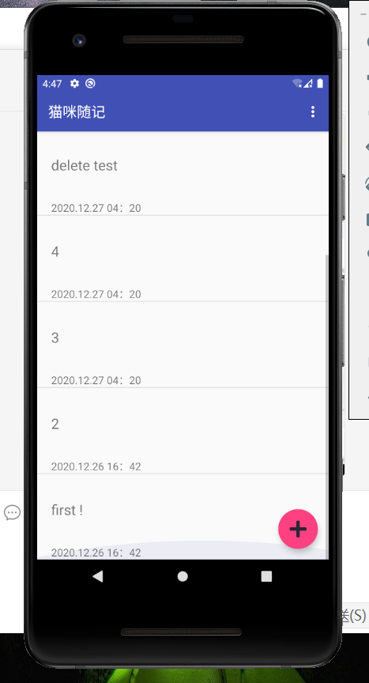

如果想删除某个随记，长按想要删除的随记会弹出是否删除的功能，根据你的需求可以进行是否删除的操作
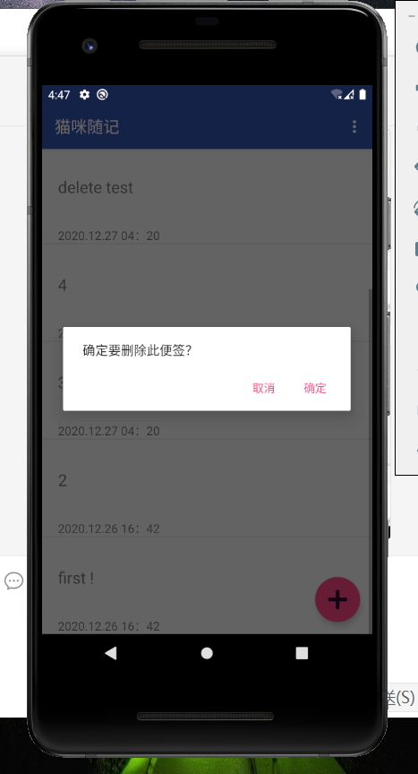

我们点击右上角的memu可以看到，会有三个功能，第一个是新建，第二个是推出，第三个是帮助/作者/更新
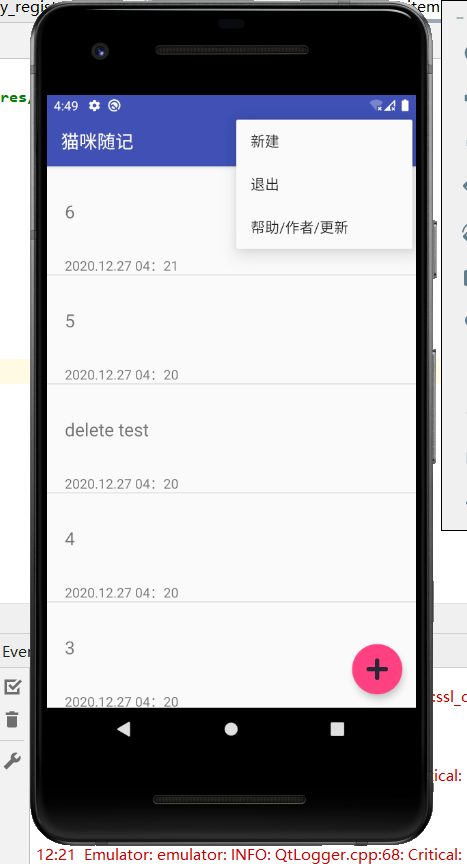

如何新建一个随记，有两种方法，第一种是点击memu中的新建，第二种是点击主界面右下角的＋号进行创建。

新建随记的界面如下
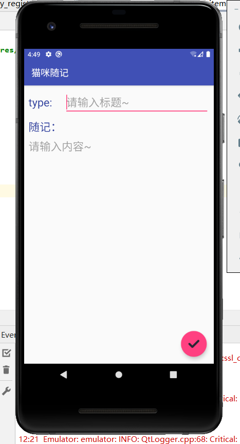

接下来我们回到主界面可以看到新的随记已经创建成功，接下来我们进入帮助/作者/更新的环节。

点击按钮后我们首先会显示帮助，帮助可以带你了解这个程序的主要功能。
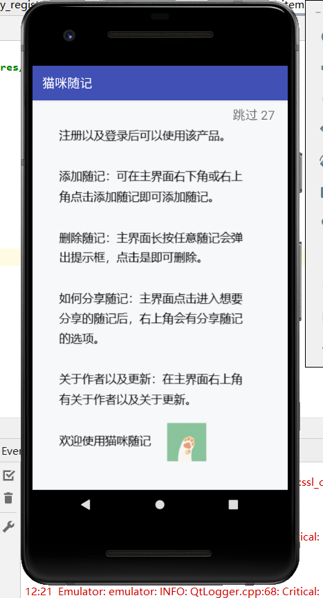

等倒计时结束或者点击跳过按钮后会跳转到作者信息
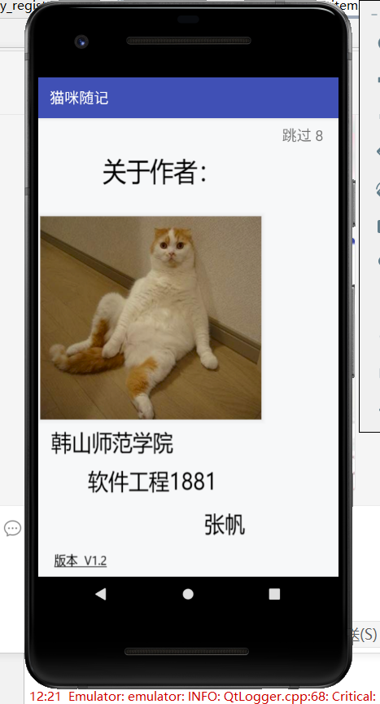

等倒计时结束或者点击跳过按钮后会跳转到更新的信息
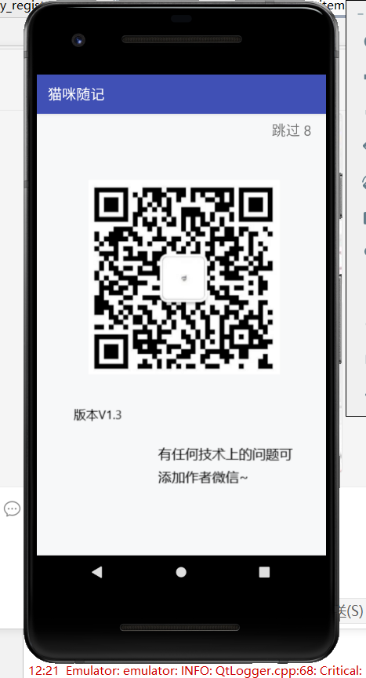

我们回到主界面，测试最后的一个功能，退出功能
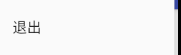

点击退出功能后我们会回到主界面
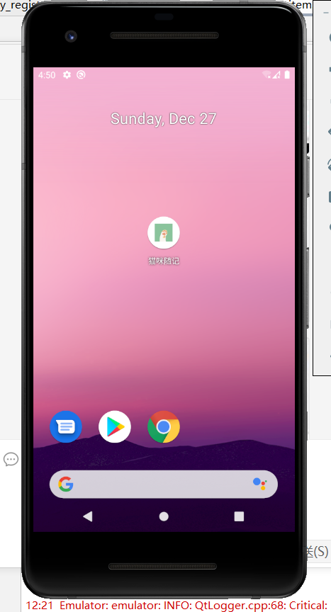

当然我们再次点击进入APP并且登录后可以看到主界面如下
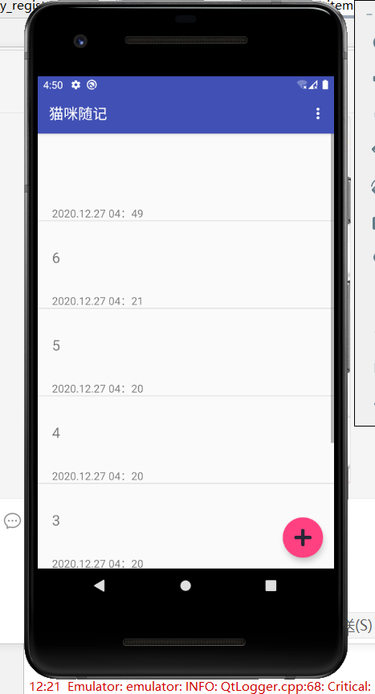

APP试运行结束，感谢各位的观看

结论：通过这次课程大作业APP设计，我对登录和注册的界面更加熟练了，学会了许多东西，十分感谢杨老师这一学期的教导，让我学会了如何用Android studio去做一个个精美的小程序。