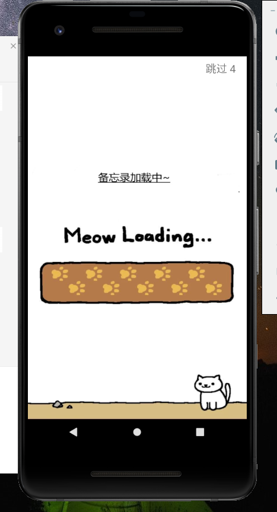
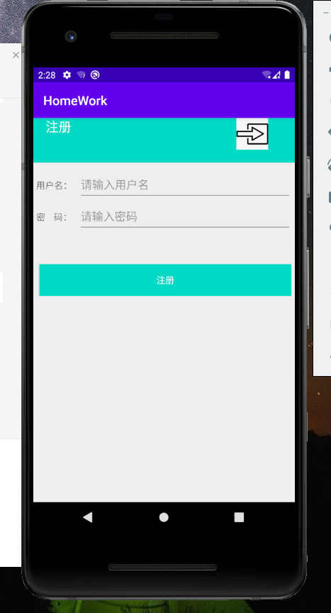
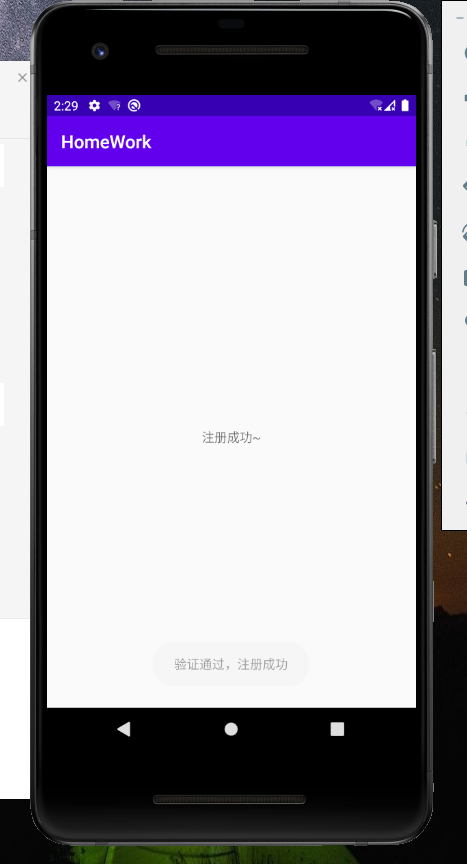
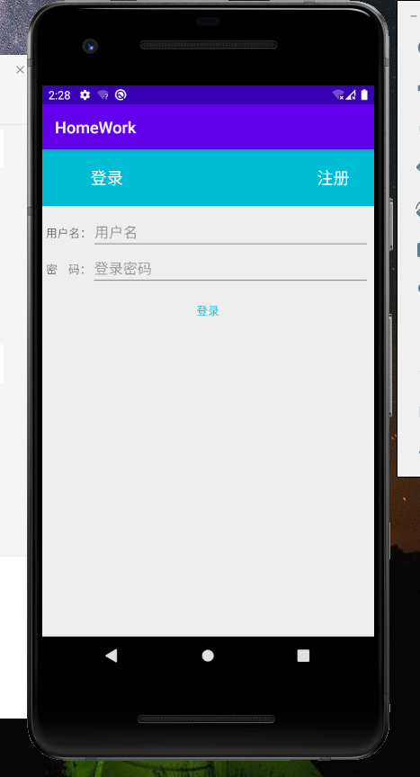
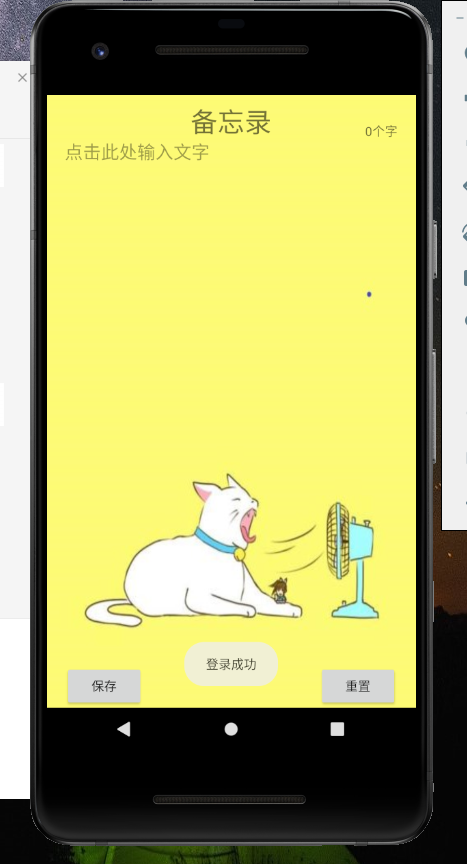
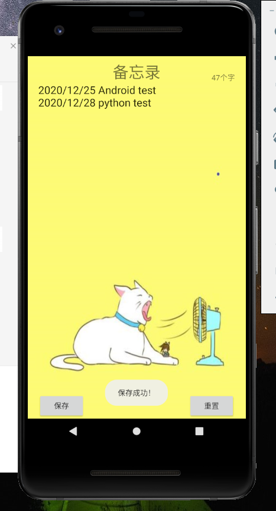
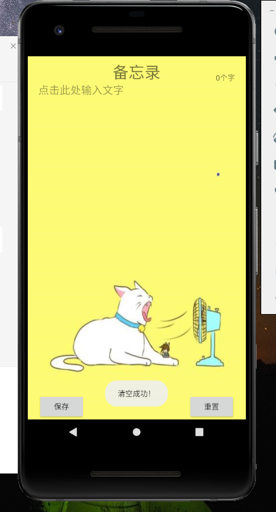

      Android课程大作业
			猫咪备忘录

打开这款猫咪备忘录APP，会有一个welcome的界面，可以在五秒读条后进入注册界面，也可以在五秒读条的时候点击跳过从而进入注册界面。

进入注册界面后我们要注册一个账号，账号可以由任意数字任意字母等组成，然后注册成功后，会提示注册成功。

重新进入这款猫咪备忘录APP，我们再次跳过welcome界面后可以看到注册界面有一个按钮，点击那个按钮可以进入登录界面。

进入登录界面后，输入刚刚注册的账号和密码进入备忘录。

进入备忘录后，可以看到界面有保存和清空两个按钮，在写完备忘录后可以保存，保存成功后会有提示，这时候退出APP然后重新登录进入猫咪备忘录也能看到刚刚写的备忘录内容。

点击清空会将备忘录的内容进行清空。

结论：通过这次APP设计，我对登录和注册的界面更加熟练了，也成功使用了链接文档进行内容的备份，学会了许多东西，十分感谢杨老师这一学期的教导，让我学会了如何用Android studio去做一个个小程序。