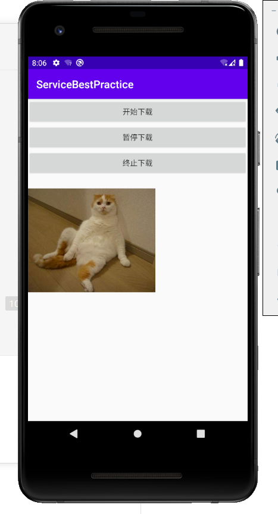
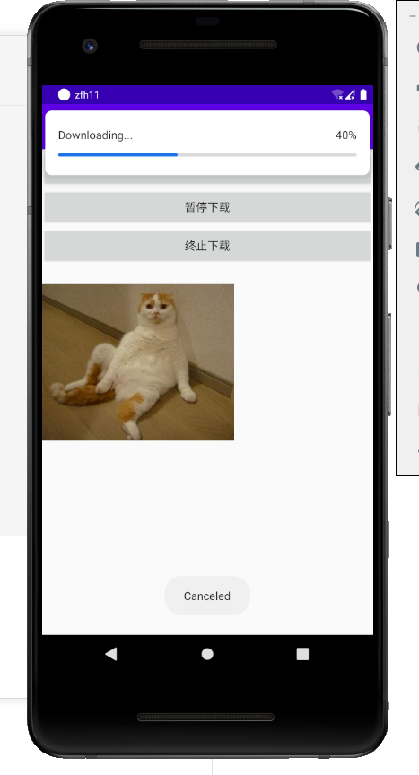
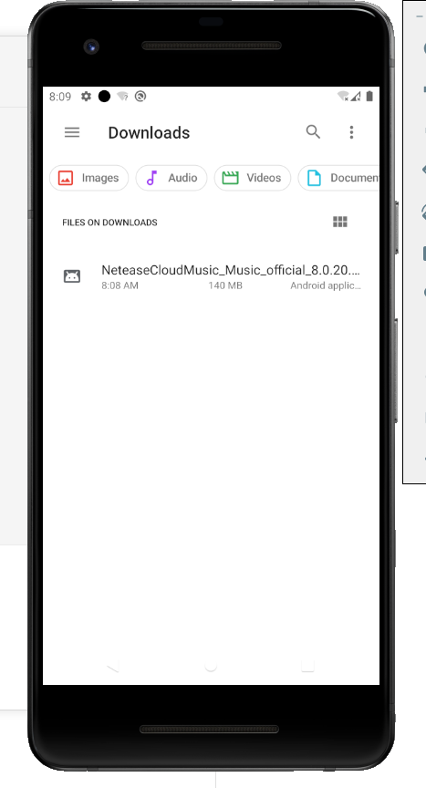

实验十一

子服务的绑定，子服务代码运行在异步任务

运行APP，会提示你是否允许连接SD卡，选择ALLOW继续进行，进入后程序的界面如图所示，下载任务，暂停下载，终止下载组成

点击开始下载后任务开始进行下载，我们这次下载的是网易云APP，下载过程会有读条

下载过程中我们可以点击暂停下载对下载进行暂停，然后读条会停止，下面会显示Paused字样表示暂停下载

点击开始下载后会继续进行下载

在下载过程中按终止下载会显示canceled并结束这次下载

然后再次点击开始下载我们会发现要从头开始下载了

读条完成表示下载成功，成功后会提示Download Success表示下载完成

这个时候我们点开虚拟安卓机中的下载中可以看得见我们下载的网易云APP

