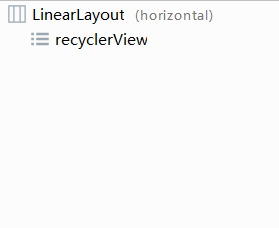
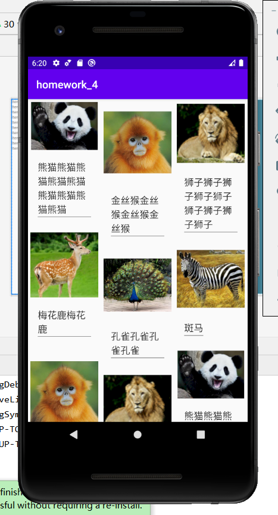
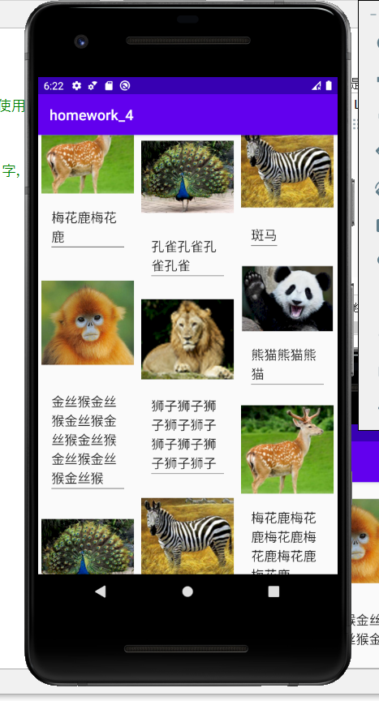
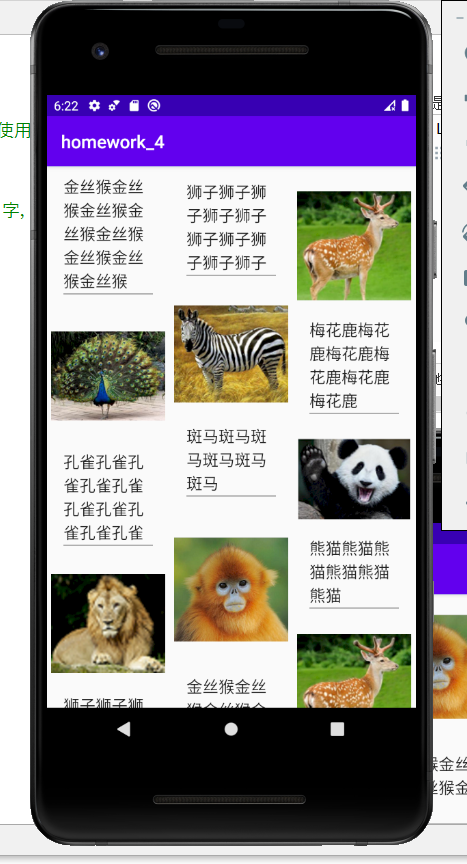
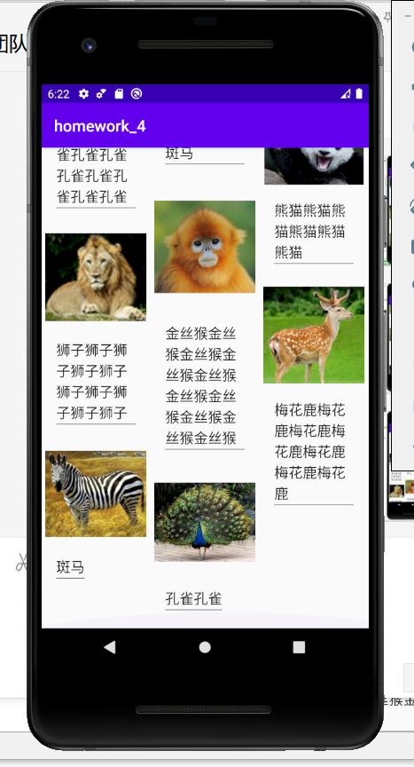

目的：使用RecyclerView

实验过程：
	简单介绍，这次实验主要是掌握RecyclerView的使用，因此采用了布局以及RecyclerView都是简单的使用。

	这次我做的是一个动物园动物的照片以及他们的名字，使用的是RecyclerView，接下来是程序的主界面

	继续向下拖动，他会继续显示

实验总结：
	通过这次实验我掌握了基本的recyclerView的使用，也更加深入了解了安卓的各项视图和布局功能。
