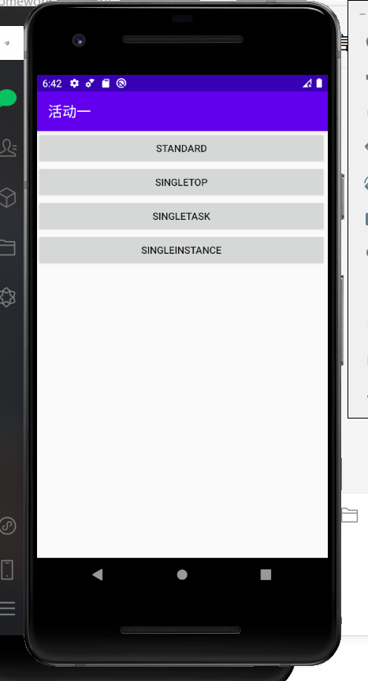
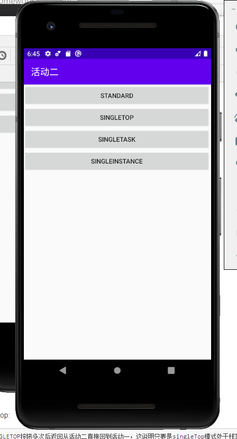
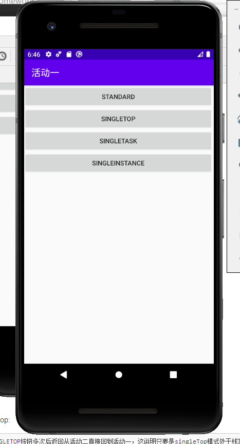
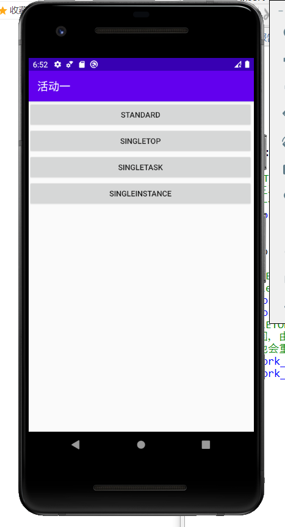
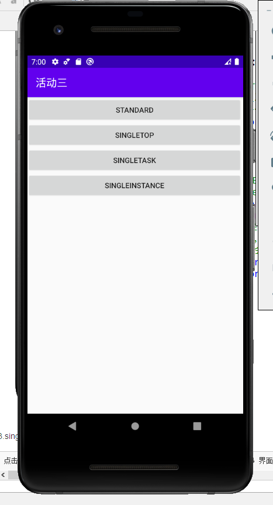
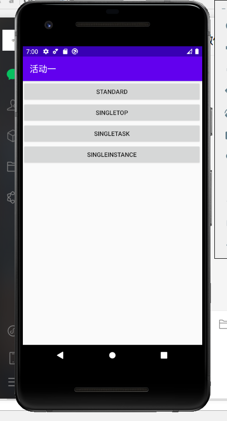
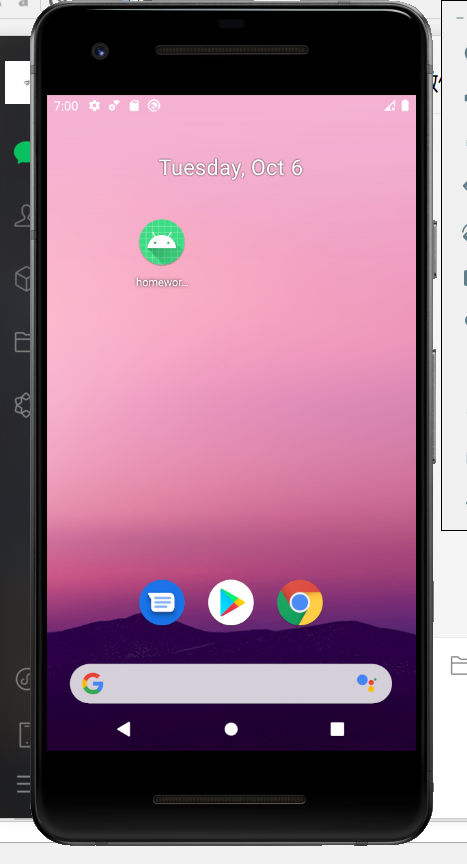
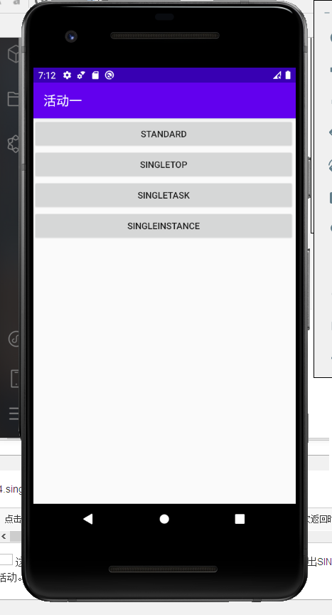
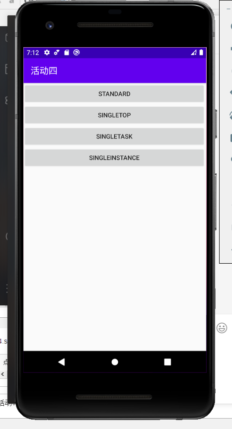
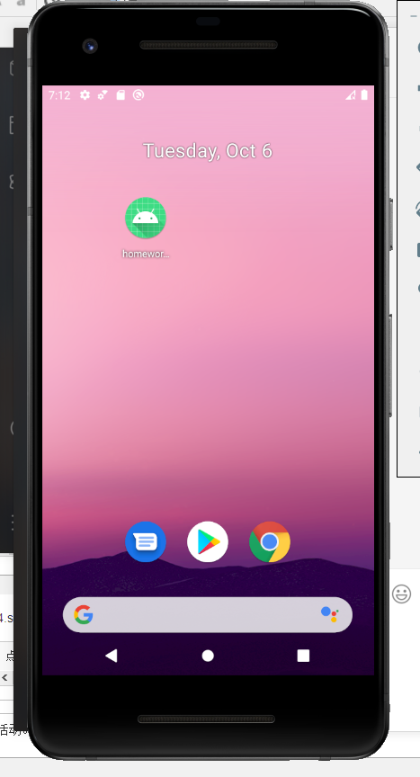

Activity的四种启动模式：  
    1. standard  
        默认启动模式，每次激活Activity时都会创建Activity，并放入任务栈中，永远不会调用onNewIntent()。  
    2. singleTop  
        如果在任务的栈顶正好存在该Activity的实例， 就重用该实例，并调用其onNewIntent()，否者就会创建新的实例并放入栈顶(即使栈中已经存在该Activity实例，只要不在栈顶，都会创建实例，而不会调用onNewIntent()，此时就跟standard模式一样)。  
    3. singleTask  
        如果在栈中已经有该Activity的实例，就重用该实例(会调用实例的onNewIntent())。重用时，会让该实例回到栈顶，因此在它上面的实例将会被移除栈。如果栈中不存在该实例，将会创建新的实例放入栈中（此时不会调用onNewIntent()）。   
    4. singleInstance  
        在一个新栈中创建该Activity实例，并让多个应用共享改栈中的该Activity实例。一旦改模式的Activity的实例存在于某个栈中，任何应用再激活改Activity时都会重用该栈中的实例，其效果相当于多个应用程序共享一个应用，不管谁激活该Activity都会进入同一个应用中。  

实验过程：
  1.standard：

	点击三次STANDARD按钮，界面闪动了三次并且都进入了活动一，这说明创建了三次实例，点击返回后均返回活动一，这说明standard每次都会创建一个实例。

  2.singleTop:
    
	点击SINGLETOP按钮多次后返回从活动二直接回到活动一，这说明只要是singleTop模式处于栈顶他会直接返回主界面。

	点击SINGLETOP按钮后再次点击STANDARD按钮如此重复操作两次，最后开始返回，由于活动二不是处于栈顶因此返回两次，这说明只要不处于栈顶他会重复创建实例。

 3.singleTask

	点击SINGLETASK按钮后再次点击STANDARD按钮三次，再点击进入SINGLETASK，界面闪动进入活动三，点击返回按钮后回到活动一，再次点击返回按钮退出程序，由此可得出，整个过程只剩下一个实例。

 4.singleInstance

	点击SINGLEINSTANCE按钮后点击STANDARD按钮，返回时先返回了活动一，再次返回时返回了活动四，再次点击返回时回到了主界面。

	这说明SINGLEINSTANCE按钮会先返回管理程序的活动，最后再退出SINGLEINSTANCE活动。

    